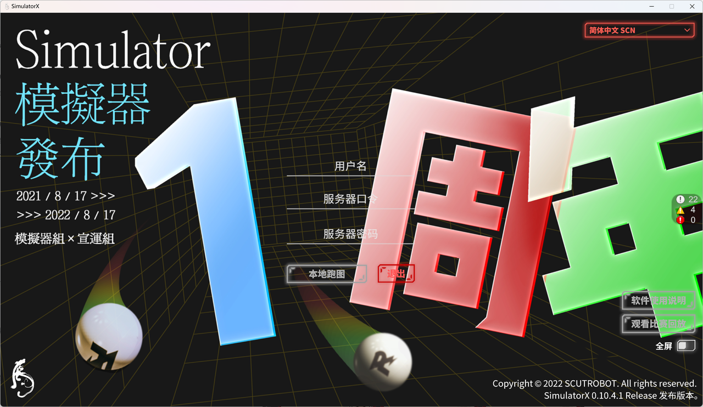
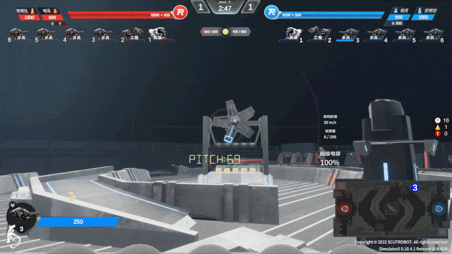
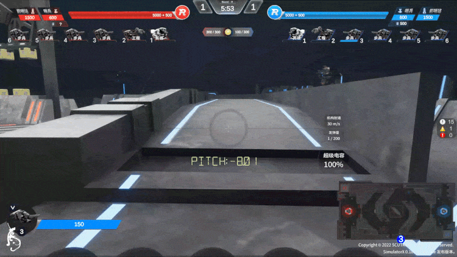
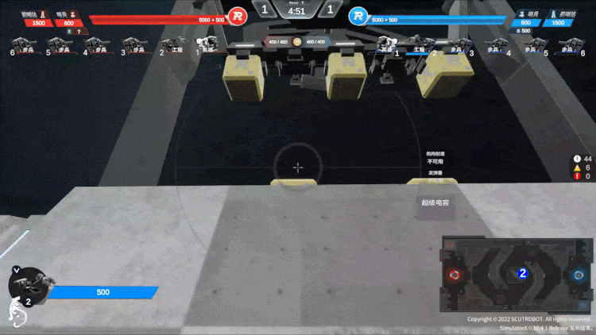

# RM2022 华南理工大学 华南虎 SimulatorX 开源技术报告

为了在疫情防控形势严峻、造车排期紧张的 2021 赛季备赛期间，给操作手们提供跑场、对战训练、战术分析的条件，弥补先前仿真系统联机功能相对较弱的缺口，华南虎战队开发了一套 RMUC 比赛模拟器软件。2022 赛季，我们完全重构了模拟器，并推出了全新的 SimulatorX。

这是华南理工大学华南虎战队 2022 赛季 SimulatorX 模拟器的开源技术报告。本文档主要对模拟器及其支持软件的开发历程、技术架构、实现细节进行分享。

我们建议您先阅读以下内容，以便于更好地理解本文档：

- [RM2021 华南理工大学 华南虎 RMUC 模拟器开源](https%3A%2F%2Fbbs.robomaster.com%2Fforum.php%3Fmod%3Dviewthread%26tid%3D12194)
- [GitHub Wiki RM2021_simulation](https%3A%2F%2Fgithub.com%2Fscutrobotlab%2FRM2021_simulation%2Fwiki)

相关资料请移步：

- RoboMaster 论坛
- [GitHub Wiki](https%3A%2F%2Fgithub.com%2Fscutrobotlab%2FRM2022_SimulatorX%2Fwiki)
- [SimulatorX 官方网站](https%3A%2F%2Fsim.scutbot.cn%2F)
- [SimulatorX 说明书](https%3A%2F%2Fintro.sim.scutbot.cn)
- [SimulatorX 下载站](https%3A%2F%2Fdl.sim.scutbot.cn%2F)
- [SimulatorX 发布会视频](https%3A%2F%2Fwww.bilibili.com%2Fvideo%2FBV1ua411T7Gh)

## 研发历程

让我们回顾一下 SimulatorX 这一年的重要时间节点。

2021 年 9 月，机器人实验室完成了招新。实验室迎来了一批新的虎崽，其中新队员孟恒宇和盛鸣芝在老队员黄扬的带领下，开始了模拟器的学习和研发。经过了半年的努力，新版模拟器的架构逐渐成型。2022 年 2 月，华南虎组织了队内模拟器比赛，随后，常霆钰和吴文真被模拟器所吸引，加入了模拟器组。2022 年 3 月，SimulatorX 举办了有史以来规模最大的比赛 “百校大战”——RoboMaster 操作手模拟联赛，比赛持续至 4 月，全国共有 104 所高校的队伍报名参赛。2022 年 7 月，经过了三个多月的持续研发，SimulatorX 2022UC 版本顺利完工。在宣运组徐心卓和杨卓石的帮助下，模拟器组于 7 月 25 日举办了发布会，并于 7 月 26 日发布软件包。在后续的 3 个月里，模拟器组根据用户反馈更新了众多功能并修复了不少 Bug。我们分别于 8 月 17 日和 9 月 10 日发布了一周年纪念版和中秋特别版。终于，10 月 7 日，我们迎来了第一个开放私有服务器的 Release 版本。

在一个赛季的时间里，我们一共发布了 25 个版本的 SimulatorX，内部测试版的数量则更多。如今，模拟器的 Release 版本已经开放下载，模拟器的故事还在继续...

## 效果展示

以下是模拟器部分画面的录屏展示。

激活大能量机关

环形高地视角

云台手视角

工程取矿视角

## 参与交流

模拟器开发是一项综合性很强的工作，要将它做得更好，除了需要在技术上不断突破，更离不开思维的交流碰撞。在此，我们诚邀各方有志之士一同进行新版模拟器的设计、研发工作。感兴趣的队伍可以扫描二维码或搜索 QQ 群 512097580。

## 总结展望

首先感谢华南理工大学机器人实验室华南虎战队的全体队员带给我们的支持，是实验室给了我们研发模拟器的机会。其次感谢大疆创新 RoboMaster 组委会、与我们合作办赛的哈尔滨工业大学（威海）HERO、雪中送炭援助我们服务器的四川大学磁海火锅和协助我们测试的广州城市理工学院野狼。最后还要感谢 RM 模拟器交流群中众多使用模拟器并提出宝贵意见的群友，为模拟器的更新指明了方向。

完整经历 SimulatorX 项目迭代后，组长黄扬于 2022 年 4 月成功通过 DJI 大疆创新的面试并顺利入职；常霆钰、孟恒宇、盛鸣芝和吴文真选择继续留任 2023 赛季并分别任职项目管理&后端负责人、架构负责人、仿真负责人和前端负责人。实验室于 9 月 30 日完成招新，我们迎来了 7 名模拟器组实习生，由此，模拟器组开启了新赛季的征程。

2023 赛季，我们会努力提高模拟器的流畅性，结合云服务上线更多有价值的功能，增加模拟器中的个性化配置并提供更强的仿真能力，继续保留开箱即用的官方服务器模式。我们也会继续虚心接受各位模拟器爱好者的意见和建议，协助希望举办模拟器校内赛或队内赛的队伍办赛，尝试后续再次举办模拟器操作手联赛并争取让更多学校参与其中。欢迎各位继续关注 SimulatorX 模拟器！
